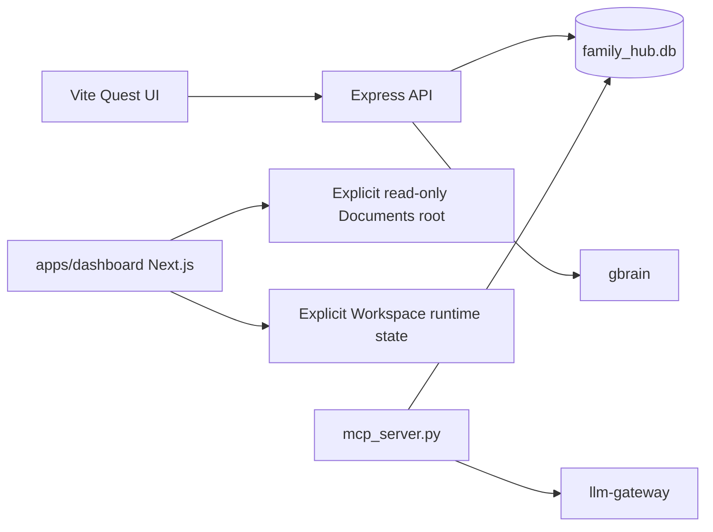

# family-hub — Architecture

> **Layer**: X 横切框架  
> **Role**: 家庭数字枢纽 — 家庭任务 gamification  
> **Stack**: React 19 + Vite + Next.js 16 + Express 5 + Python FastMCP + SQLite
> **Health**: See local scenario verification
> **SSOT**: 运行时健康、场景验证状态以本项目本地验证和 workspace governance SSOT 为准
>
> 系统全景参见：[`../../docs/PANORAMA.md`](../../docs/PANORAMA.md)

---

## 1. 内部架构



## 2. 入口

| Type | Entry | Port / Notes |
|:--|:--|:--|
| Frontend dev | `bun run dev` | Vite |
| Dashboard source | `apps/dashboard` | Not cut over in Phase A |
| HTTP API | `bun run api` | :3001 |
| MCP stdio | `uv run python mcp_server.py` |  |

## 3. 核心模块

| Module | Responsibility |
|:--|:--|
| `mcp_server.py` | FastMCP server: profiles/quests/rewards |
| `api/server.ts` | Express API + gbrain sync |
| `src/App.tsx` | React UI |
| `apps/dashboard` | Canonical Next.js dashboard source; synthetic build/E2E; direct Documents writes disabled |
| `test_real_scenario.py` | Scenario test |

## 4. 测试

```bash
cd projects/family-hub && bun run build && uv run python -m unittest discover -s tests -q
```

## 架构概览

参见工作区架构概览图：[`../../docs/ARCHITECTURE-DIAGRAM.md`](../../docs/ARCHITECTURE-DIAGRAM.md)
