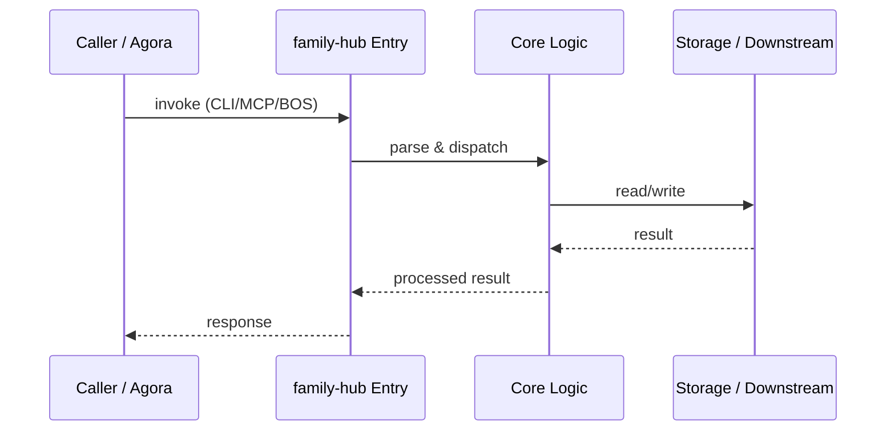

# family-hub — Call Chain

> 本文档描述 family-hub 内部最核心的一条调用链 / 数据流。
>
> 通用跨层调用链参见：[`docs/I0-AGORA-CALLCHAIN.md`](../docs/I0-AGORA-CALLCHAIN.md)

---

## 关键路径

1. 1. Frontend calls Express API `POST /api/quests`
2. 2. `api/server.ts` seeds profiles/quests into SQLite
3. 3. MCP server exposes `create_quest`, `complete_quest`
4. 4. `generate_smart_quests` calls LLM gateway
5. 5. Completions synced to gbrain via `gbrain/src/cli.ts put`

## Sequence Diagram

